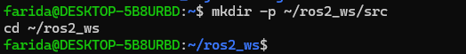
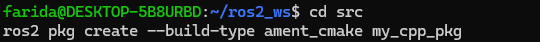
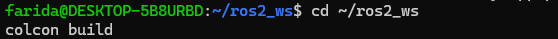
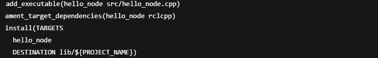
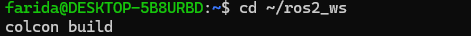
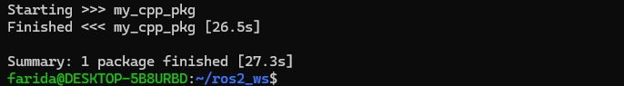
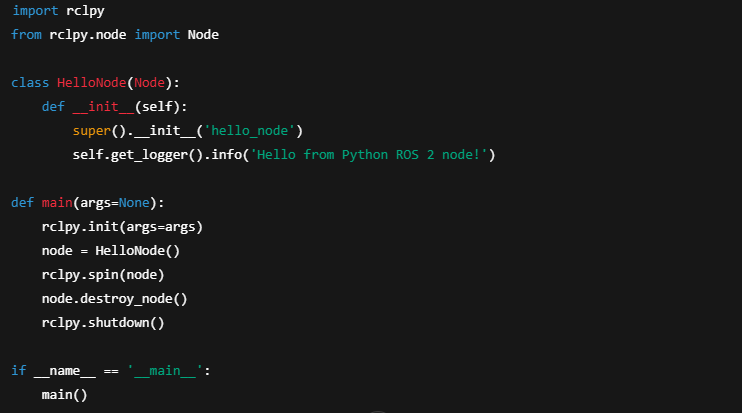
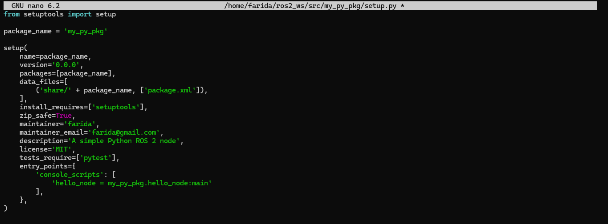
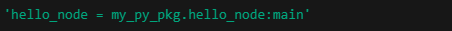
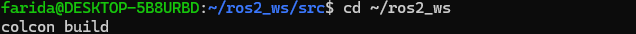

# ROS2 Workspace Setup
Setting up a ROS 2 workspace means creating a structured environment where you can build, organize, and manage your own ROS 2 packages.

*In brief: A ROS 2 workspace is a directory with a specific structure that allows you to develop and build ROS 2 nodes (programs), libraries, and other components using tools like colcon.*

The following steps are followed to setup the ROS2 Workspace:

### 1. Create workspace directory

The image above shows the command used to create the workspace directory. Once the directory is created we are able to navigate it.
**mkdir -p** creates the workspace folder (ros2_ws) and a src/ subdirectory.
**The src/ folder** is where ROS 2 looks for packages to build.
**cd** navigates into the workspace so you can build or manage packages.

### 2.Create a new package

**ros2 pkg** create initializes a new ROS 2 package.
**--build-type ament_cmake** tells ROS 2 you’ll use CMake (for C++).
**my_cpp_pkg** the name of your new package.

### 3.Build the workspace

**colcon** scans the src/ folder for ROS 2 packages.
For each package:
It configures it using CMake (or setup.py for Python).
Compiles source files
Creates symlinks or copies build artifacts into install/

### 4.Source the workspace

It loads the packages you just built into your current shell session.
It updates your shell environment to include:
New package paths
New executables and libraries

*If this step is skipped, ros2 run and other tools won’t know about your custom packages.*

ROS 2 separates your system ROS packages (/opt/ros/humble) from your own. You have to manually source your workspace's environment each time you open a terminal unless you automate it using the command below:

## Write and Build a Node
ROS nodes are small programs that:
Publish/subscribe to topics
Call/offer services
Control robots or sensors

### 1. Using C++
**Create a file as shown below:**

**Paste a minimal ROS 2 C++ node and save:**
**Modify CMakeLists.txt to Build the Node as shown below:**

**Add this block after find_package(rclcpp REQUIRED):**

Then save and close.
**Rebuild the workspace as shown below:**

The workspace is successfully rebuilt as shown below:

**Source it:**

**Then run your node:**

Output is as shown below:

### 2. Using Python
**Create a Python package**
Navigate to your workspace src directory:

Create a Python package (we'll call it my_py_pkg):

**Write your Python Node**
Create a Python Script file:

Paste this simple node:

**Update setup.py**
Open:

Update it as follows:

The line below means ROS will run the main() function in hello_node.py.

**Make the node executable**
Give it execute permission:

**Build the workspace**
Go back to the root of your workspace and build:

Source it:

**Run your Python Node**

The output is as shown:

